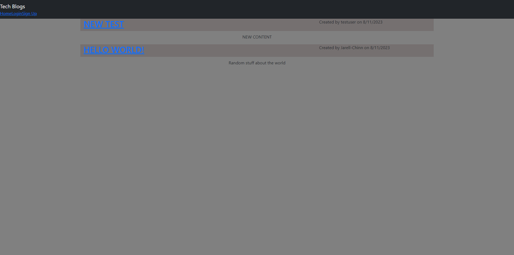

# Tech-Blog (Not Finished)

## Technology Used

| Technology Used |                                                    Resource URL                                                    |
| --------------- | :----------------------------------------------------------------------------------------------------------------: |
| JavaScript      | [https://developer.mozilla.org/en-US/docs/Web/JavaScript](https://developer.mozilla.org/en-US/docs/Web/JavaScript) |
| Nodejs          |                                   [https://nodejs.org/en](https://nodejs.org/en)                                   |
| bcyrpt          |                                   [https://bcrypt.online](https://bcrypt.online)                                   |
| handlebars      |                                [https://handlebarsjs.com](https://handlebarsjs.com)                                |
| mysql           |                                   [https://www.mysql.com](https://www.mysql.com)                                   |

## Description

A tech blog that hosts different posts by different users showing the time of creation.

## Usage

You can click on the drop down menu to navigate towards the login signup and homepage to sign in or sign up just enter credentials.

## Learning Points

1. How to use bcrypt to hash passwords and protect user infomation
2. How to display content on a webpage using handlebars

## Features that are missing

I wasn't able to complete this in time before due date I
opening one post to lead to a page where a post can be read and see comments. I plan to complete this assignment after the upcoming project.

## Author Info

- [GitHub](https://github.com/Jarell-Chinn)
